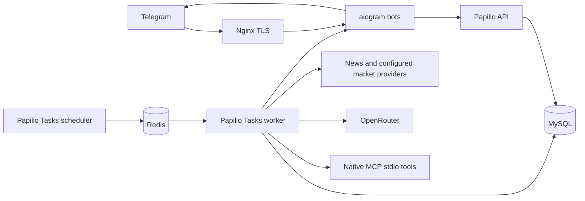

# Architecture

## Runtime boundaries

`api/src/modules` follows the Auryx backend's application, infrastructure and
presentation boundaries. Domain models and explicit DTOs define persisted
records and changes. Repositories perform SQL. Repository-backed CRUD services
own one repository. Commands coordinate multiple writes and business workflows.
Composite SQL lives in readers with declared read models. Routers and tasks
resolve explicit interfaces through Dishka providers.

Papilio owns application discovery, API responses, dependency lifecycle, native
MySQL units of work and transactions. Papilio Tasks owns broker, task discovery,
scheduling and Redis transport. Frameworks are pinned to full commits; this
project does not modify or replace their infrastructure. Worker and scheduler
use the same discovered tasks and Redis settings.

## Workflow owners

| Module | Owned workflow |
| --- | --- |
| `configuration` | Definition/value CRUD, scoped schemas, sources, seed and snapshots |
| `missions` | Admission, duplicate updates, owner concurrency, execution, cancellation and recovery |
| `news` | Source fetching, article reading and persisted evidence |
| `market` | Typed source/aggregate snapshots and linked deterministic drafts |
| `rick` | Both persona prompts, model checkpoints, budgets, MCP tools |
| `content` | Draft revisions and human decisions |
| `publishing` | Shared quota, scheduling, rendering, delivery and ambiguous results |
| `ops` | Publishing pause, invariant locks, health and queue read models |

The `rick` module hosts the common model coordinator for either persona; a
second model service is not required. Team news work collects source artifacts
before the model receives evidence tools. Handoffs use persisted backend state,
not messages between Telegram bots.

## Transactions and concurrency

Admission locks one owner guard to enforce a shared active-mission limit and
checks the unique `(bot_id, update_id)` key with a current locking read. An
execution claims a queued mission in a short transaction, performs network work
outside that transaction, then reloads its locked state to respect cancellation
and deadlines before committing a result or outbox reply.

One native task executes one model step. Checkpoints persist history, tool-call
IDs and counters. A day-specific budget row is locked before a paid request;
the reservation and run record commit before HTTP. Unknown HTTP outcomes retain
their reservation and are not replayed automatically. Tools receive owner and
mission context from the host. The model cannot choose an owner or publish.

Draft approval binds owner, originating bot and revision. Editing increments
the revision and removes approval. Publication scheduling deduplicates the
draft/revision pair. A shared publishing guard serializes quota reservation
across both bot identities. Under MySQL's repeatable-read isolation, locking
reads refresh ORM objects and use current state for duplicate and quota checks.

Delivery commits `sending` before contacting Telegram. Success stores the
message ID. Explicit rejection releases quota; a rate limit schedules a future
attempt. Timeout, disconnect or an interrupted sending lease becomes `unknown`
and retains the day's reservation. An owner must record a known message ID or
explicitly authorize resending. Private replies use their own sending leases
and do not consume channel quota.

## Persistence and configuration

The initial static Alembic migration creates 16 native tables with primary
keys, foreign keys, uniqueness and queue indexes. Runtime startup never uses
`create_all`. Migrations run before the seed and applications. Tests compare
the migrated schema with discovered metadata.

Setting definitions and scoped values are separate entities. News source
definitions and source options also have separate repositories and services.
Seed inserts preserve existing values and revisions. All business snapshots
are request-scoped: edits affect the next request or task. Technical protocol
routes, enum names and safety bounds remain code contracts.

## Evidence and market safety

News drafts must cite collected article IDs from their own mission. Article
content is external data, not model instructions. A source failure cannot
produce a fabricated news post. HTML output escapes all draft and style text.

Market drafts store a complete typed snapshot with raw currency, basis, purity,
quote time and fetched time. Decimal rial-to-toman conversion happens once.
Approval and dispatch recheck freshness and the deterministic body hash.
Fabricated, edited or incomplete market content cannot pass publication.
